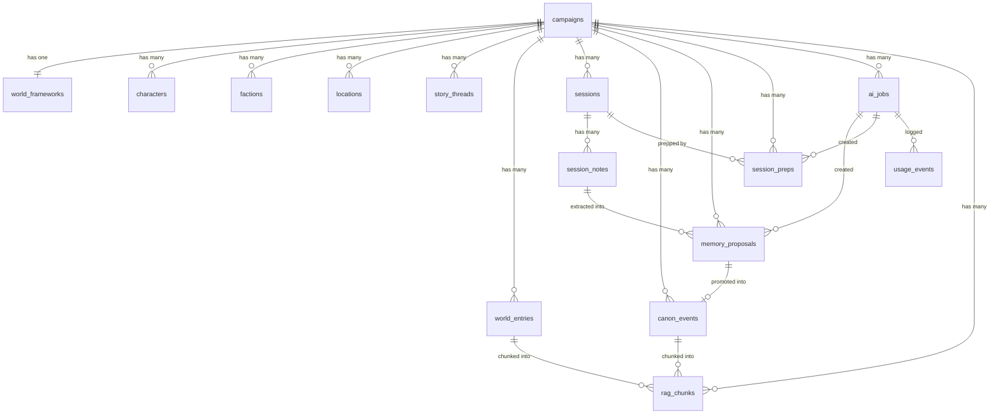
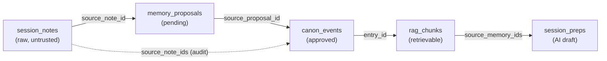

# Data Model — AI Campaign Orchestration Platform

**Version:** 0.1 (prototype)
**Stack:** PostgreSQL. IDs are human-readable strings (e.g. `economy_foundation_001`) to make debugging and demos easy.
**Purpose:** Define every table the prototype stores, explained in plain language *and* in the context of a tabletop role-playing game (TTRPG), with runnable SQL.

This document is the bridge between the two architecture docs and real code. It reconciles the normalized tables in
[SOFTWARE_ARCHITECTURE.md §5](SOFTWARE_ARCHITECTURE.md) with the flexible "world category → entries" shape used in the
sample dataset ([ashes_kestrel_10_session_data_set.json](../synthetic-data/ashes_kestrel_10_session_data_set.json)).

---

## 1. Tabletop RPG concepts (glossary for the unfamiliar)

You don't need to have played a tabletop RPG to build this. Here are the only terms that matter for the data model:

| Term | Plain-language meaning |
|---|---|
| **TTRPG** | Tabletop role-playing game — a collaborative storytelling game (e.g. *Dungeons & Dragons*) played by a group around a table (or online). |
| **Game Master (GM)** | The one person who runs the game: describes the world, plays every non-player character, and decides what's "true" in the story. **The GM is our app's user.** |
| **Player Characters (PCs)** | The heroes controlled by the players (not the GM). In our data: `pc_talon_ashvale`, a "Pact-scarred Ranger." |
| **NPCs** (Non-Player Characters) | Everyone else in the world — villains, shopkeepers, allies — all voiced by the GM. |
| **Campaign** | One long, continuous story told across many sessions, like a TV series. Our sample campaign is *"Ashes of Kestrel Vale."* |
| **Session** | One sitting of play, like a single episode. Our sample has 10 sessions. |
| **Canon** | The facts that are officially "true" in the campaign world. If something is canon, everyone agrees it really happened. This is the trusted memory the AI is allowed to build on. |
| **World / lore** | The setting's background: its economy, politics, laws, magic, factions, geography. The stage the story happens on. |
| **Faction** | An organized group with goals — a guild, a cult, a government. E.g. the *Salt Guild*, the *Iron Court*. |
| **Story thread / hook** | An unresolved plot line — a mystery, quest, or conflict that hasn't been wrapped up yet. |
| **Session prep** | The GM's homework *before* a session: planning scenes, encounters, and NPCs. **AI Workflow 1 generates a draft of this.** |
| **Session notes** | What the GM jots down *after* a session about what actually happened. Raw and messy. **AI Workflow 2 reads these to propose canon updates.** |

### The core loop in one sentence
The GM sets up a world → the AI drafts **session prep** from approved **canon** → they play → the GM writes **raw notes** →
the AI extracts **proposals** → the GM approves them into **canon** → which feeds the next prep. The AI proposes; **the GM decides what becomes canon.**

---

## 2. The trust model (why data lives where it lives)

The single most important idea in this schema: the *same fact* is stored in different tables depending on how "real" it is yet.

```
Raw notes            AI proposals          GM review           Approved canon
(untrusted input) →  (pending)         →   (human decides)  →  (trusted memory)
session_notes        memory_proposals                          canon_events / world_entries
                                                               tagged "approved_canon"
     │                     │                                          │
     └── stored & audited, but NEVER fed to the AI ──────────┘        └── THIS is what the AI retrieves (RAG)
```

- **Untrusted ≠ wrong.** Raw notes are the true record of what happened at the table — but they're messy, unreconciled, and unsafe to feed straight to the model. They must be refined into structured, approved canon first.
- **The trust boundary is enforced by one query filter** (see §9): the AI only ever reads rows tagged/approved as canon.

---

## 3. Table overview

| # | Table | In game terms | Trust level |
|---|---|---|---|
| 1 | `campaigns` | The whole story / series | shell |
| 2 | `world_frameworks` | The setting's premise, tone, and rules | shell |
| 3 | `characters` | Heroes (PCs) and NPCs | entity (canon) |
| 4 | `factions` | Guilds, cults, governments | entity (canon) |
| 5 | `locations` | Cities, regions, landmarks | entity (canon) |
| 6 | `story_threads` | Open mysteries / quests | entity (canon) |
| 7 | `world_entries` | Flexible lore (economy, laws, magic…) | entity (canon when tagged) |
| 8 | `sessions` | One episode of play | record |
| 9 | `session_notes` | Raw post-session notes | ⚠️ untrusted |
| 10 | `memory_proposals` | AI-suggested canon changes awaiting review | pending |
| 11 | `canon_events` | Approved historical facts | trusted |
| 12 | `session_preps` | AI-drafted prep the GM edits | draft |
| 13 | `rag_chunks` | Search-ready pieces of canon | retrieval index |
| 14 | `ai_jobs` | Background AI task queue | plumbing |
| 15 | `usage_events` | Token/cost/latency logging | plumbing |

Deferred for the prototype (single hardcoded owner is fine for now): `users`, `auth_identities`, `campaign_members`, `audit_events`.

---

## 4. Group 1 — Campaign shell

Set once per campaign; rarely changes. This is the fixed "stage."

```sql
-- One long story told across many sessions (like a TV series).
CREATE TABLE campaigns (
    id                  text PRIMARY KEY,        -- e.g. campaign_ashes_of_kestrel_vale
    name                text NOT NULL,           -- "Ashes of Kestrel Vale"
    description         text NOT NULL DEFAULT '',-- one-paragraph blurb shown on the dashboard tile
    system              text,                    -- rules system, e.g. "D&D 5e" (free text for prototype)
    status              text NOT NULL DEFAULT 'planning', -- active | planning | paused
    world_status        text NOT NULL DEFAULT 'draft',    -- draft | sealed (World Builder lifecycle)
    tone                jsonb,                   -- mood tags: ["grim","mythic","political"]
    logline             text,                    -- one-sentence pitch of the campaign
    role                text NOT NULL DEFAULT 'owner',   -- owner | gm | player | viewer (this user's role)
    visibility          text NOT NULL DEFAULT 'private', -- private | shared
    model_profile       text NOT NULL DEFAULT 'balanced',-- cheap | balanced | premium
    last_session_number integer NOT NULL DEFAULT 0,
    next_session_label  text NOT NULL DEFAULT 'Initial world setup incomplete',
    created_at          timestamptz NOT NULL DEFAULT now(),
    updated_at          timestamptz NOT NULL DEFAULT now()
);
-- World-building lifecycle: 'draft' while the GM builds the world once (add entries
-- + check empty categories for the AI to draft, then a single build); 'sealed'
-- after, when the World Builder is read-only and all further change flows through
-- session notes -> extract_memory -> review queue.

-- The creative "rules of the setting" the AI must respect when it generates anything.
CREATE TABLE world_frameworks (
    id                 text PRIMARY KEY,
    campaign_id        text NOT NULL REFERENCES campaigns(id),
    premise            text,                    -- the core situation of the world
    tone               text,                    -- e.g. "Dark heroic fantasy with political tension"
    themes             jsonb,                   -- ["lost gods","faction rivalry"]
    constraints        jsonb,                   -- guardrails: ["avoid slapstick","keep horror PG-13"]
    starting_situation text,                    -- where the story begins
    updated_at         timestamptz NOT NULL DEFAULT now()
);
```

---

## 5. Group 2 — World entities (the "nouns" of the campaign)

These are the people, groups, and places the AI must recognize by name and stay consistent with.
The first four are **normalized** (one table each, because they're referenced everywhere). The fifth, `world_entries`,
is a **flexible catch-all** that matches the sample dataset's "category → entries" shape (economy, laws, magic, etc.).

```sql
-- Heroes (PCs) and everyone the GM voices (NPCs).
CREATE TABLE characters (
    id           text PRIMARY KEY,              -- e.g. pc_talon_ashvale
    campaign_id  text NOT NULL REFERENCES campaigns(id),
    name         text NOT NULL,                 -- "Talon Ashvale"
    kind         text NOT NULL,                 -- 'pc' | 'npc'
    ancestry     text,                          -- fantasy "species/heritage", e.g. "Human"
    role         text,                          -- "Pact-scarred Ranger" / "Harbor informant"
    current_goal text,                          -- what they want right now
    summary      text,
    status       text NOT NULL DEFAULT 'active',-- active | archived
    tags         jsonb                          -- ["talon","pc_hooks"]
);

-- Organized groups with goals: guilds, cults, governments.
CREATE TABLE factions (
    id           text PRIMARY KEY,
    campaign_id  text NOT NULL REFERENCES campaigns(id),
    name         text NOT NULL,                 -- "The Salt Guild"
    summary      text,
    goals        jsonb,                         -- ["control salt access","collect debts"]
    status       text NOT NULL DEFAULT 'active',
    tags         jsonb
);

-- Places: cities, regions, dungeons, landmarks.
CREATE TABLE locations (
    id           text PRIMARY KEY,
    campaign_id  text NOT NULL REFERENCES campaigns(id),
    name         text NOT NULL,                 -- "Kestrel Gate"
    kind         text,                          -- city | region | landmark | dungeon
    summary      text,
    status       text NOT NULL DEFAULT 'active',
    tags         jsonb
);

-- Unresolved plot lines: mysteries, quests, conflicts the story hasn't closed yet.
CREATE TABLE story_threads (
    id                 text PRIMARY KEY,
    campaign_id        text NOT NULL REFERENCES campaigns(id),
    title              text NOT NULL,           -- "Find the source of the ash-scar pact"
    summary            text,
    status             text NOT NULL DEFAULT 'open', -- open | resolved | paused | abandoned
    priority           text,                    -- low | medium | high
    related_entity_ids jsonb                    -- links to characters/factions/locations
);

-- Flexible lore that doesn't fit the tables above: economy, politics, laws, magic systems,
-- artifacts, ecosystems, eras, etc. Mirrors the dataset's "world category -> entries" shape.
CREATE TABLE world_entries (
    id           text PRIMARY KEY,              -- e.g. economy_foundation_001
    campaign_id  text NOT NULL REFERENCES campaigns(id),
    category     text NOT NULL,                 -- economy | politics | laws | magic_systems | ...
    title        text,                          -- short UI-facing label, e.g. "Bridge tariffs"
    note         text,                          -- full lore text
    summary      text,
    entry_tags   jsonb,                         -- ["foundation","approved_canon","tariffs"]  <-- trust marker
    date_created timestamptz,
    last_updated timestamptz
);
```

> **Why `entry_tags` matters:** the tag `"approved_canon"` is the trust switch. Only tagged rows are eligible to be
> retrieved as AI context (see §9). Untagged/proposed lore is invisible to the model.

---

## 6. Group 3 — Sessions and raw notes

```sql
-- One sitting of play (an "episode").
CREATE TABLE sessions (
    id                 text PRIMARY KEY,        -- e.g. session_01
    campaign_id        text NOT NULL REFERENCES campaigns(id),
    session_number     int,
    title              text,                    -- "Ash Rain at Kestrel Gate"
    played_at          timestamptz,
    status             text,                    -- planned | completed | archived
    summary            text,                    -- cleaned recap
    related_entry_ids  jsonb                    -- world entries this session touched
);

-- The GM's RAW notes after play. Stored and audited, but treated as UNTRUSTED:
-- messy, unreconciled, and never fed to the AI as authoritative context.
CREATE TABLE session_notes (
    id          text PRIMARY KEY,
    session_id  text NOT NULL REFERENCES sessions(id),
    content     text NOT NULL,                  -- ⚠️ untrusted input -> only fed to the extraction step as DATA
    source_type text NOT NULL DEFAULT 'manual_notes',
    created_at  timestamptz NOT NULL DEFAULT now()
);
```

---

## 7. Group 4 — AI output (kept separate from canon until a human approves)

```sql
-- What the AI SUGGESTS after reading raw notes. NOT yet real. Waits in a review queue.
CREATE TABLE memory_proposals (
    id                  text PRIMARY KEY,       -- e.g. proposal_session_09_bridge_wardens
    campaign_id         text NOT NULL REFERENCES campaigns(id),
    session_id          text REFERENCES sessions(id),
    source_note_id      text REFERENCES session_notes(id),
    type                text,                   -- canon_event | character_update | faction_update | location_update | story_thread_update
    category            text,                   -- world category this would file under, e.g. "economy"
    title               text,                   -- short UI-facing label for the Review Queue
    source              text,                   -- e.g. "Session notes", "World build"
    proposed_summary    text NOT NULL,          -- human-readable description of the change
    proposed_payload    jsonb,                  -- the structured change to apply if approved
    confidence          numeric(4,3),           -- 0.000-1.000
    rationale           text,                   -- why the AI thinks this
    potential_conflicts jsonb,                  -- canon this might contradict
    status              text NOT NULL DEFAULT 'pending', -- pending | approved | edited_approved | rejected | superseded
    reviewed_at         timestamptz,
    review_reason       text,                    -- e.g. reason for rejection
    -- AI metadata (see §10):
    model_provider      text,
    model_name          text,
    prompt_version      text,
    created_by_job_id   text,
    schema_version      text
);

-- Approved historical facts. This IS canon: safe, trusted, and used for future generation.
CREATE TABLE canon_events (
    id                 text PRIMARY KEY,
    campaign_id        text NOT NULL REFERENCES campaigns(id),
    summary            text NOT NULL,
    importance         text,                    -- minor | normal | major | critical
    related_entity_ids jsonb,                   -- characters/factions/locations/threads involved
    source_note_ids    jsonb,                   -- audit link back to the raw notes it came from
    source_proposal_id text REFERENCES memory_proposals(id), -- which proposal promoted this
    status             text NOT NULL DEFAULT 'active', -- active | revised | archived
    created_at         timestamptz NOT NULL DEFAULT now()
);

-- The AI-drafted prep packet the GM edits before a session (Workflow 1 output).
CREATE TABLE session_preps (
    id                text PRIMARY KEY,
    campaign_id       text NOT NULL REFERENCES campaigns(id),
    session_id        text REFERENCES sessions(id),
    title             text,
    summary           text,
    sections          jsonb,                    -- {opening, mainBeats[], npcs[], encounters[], hooks[]}
    source_memory_ids jsonb,                    -- which canon rows informed this draft
    -- Approval lifecycle: a generated prep is a 'draft' until the GM explicitly
    -- approves it as the plan for next session. Approved preps are NOT canon —
    -- they surface as a separate, clearly-labeled section in the world export.
    status            text NOT NULL DEFAULT 'draft', -- draft | approved
    approved_outline  text,                     -- the GM-edited outline text, once approved
    approved_at       timestamptz,
    -- AI metadata (see §10):
    model_provider    text,
    model_name        text,
    prompt_version    text,
    created_by_job_id text,
    schema_version    text,
    created_at        timestamptz NOT NULL DEFAULT now()
);
```

---

## 8. Group 5 & 6 — Retrieval and AI plumbing

```sql
-- Canon broken into small, search-ready pieces for Retrieval-Augmented Generation (RAG).
-- Prototype: retrieve with plain SQL + tag filters. Later: add real vector embeddings (pgvector).
CREATE TABLE rag_chunks (
    id          text PRIMARY KEY,               -- e.g. rag_chunk_0001
    campaign_id text NOT NULL REFERENCES campaigns(id),
    category    text,                           -- economy | politics | ...
    entry_id    text,                           -- source row (world_entries / canon_events)
    chunk_text  text NOT NULL,                  -- the text the model will actually see
    metadata    jsonb                           -- entry_tags, dates, etc.
    -- embedding vector(8)                       -- enable with: CREATE EXTENSION vector; then add this column
);

-- The background task queue. AI work runs here, OUTSIDE the web request, so nothing times out.
CREATE TABLE ai_jobs (
    id           text PRIMARY KEY,              -- e.g. ai_extract_session_01
    campaign_id  text REFERENCES campaigns(id),
    session_id   text REFERENCES sessions(id),
    job_type     text NOT NULL,                 -- generate_session_prep | extract_memory | fill_world_gaps | summarize_and_tag_session_entries
    status       text NOT NULL DEFAULT 'pending', -- pending | running | succeeded | failed | cancelled
    result       jsonb,                         -- e.g. {"prepId": "prep_123"}
    error        text,
    created_at   timestamptz NOT NULL DEFAULT now(),
    completed_at timestamptz
);

-- One row per LLM call: tracks tokens, cost, and latency so AI spend stays visible and capped.
CREATE TABLE usage_events (
    id               text PRIMARY KEY,
    job_id           text REFERENCES ai_jobs(id),
    campaign_id      text REFERENCES campaigns(id),
    model_provider   text,
    model_name       text,
    prompt_version   text,
    input_tokens     int,
    output_tokens    int,
    estimated_cost_usd numeric(10,4),
    latency_ms       int,
    created_at       timestamptz NOT NULL DEFAULT now()
);
```

---

## 9. The trust boundary in one query

This filter is the entire safety model. When the AI worker gathers context, it reads **only approved canon** —
never raw notes, never pending or rejected proposals:

```sql
-- ✅ Eligible as AI context: approved lore + active canon events
SELECT id, summary FROM world_entries
WHERE campaign_id = $1
  AND entry_tags @> '["approved_canon"]'::jsonb;

SELECT id, summary FROM canon_events
WHERE campaign_id = $1 AND status = 'active';

-- 🚫 NEVER selected for AI context:
--    session_notes                        (raw, untrusted)
--    memory_proposals WHERE status != 'approved'   (not signed off)
```

`session_notes` and pending `memory_proposals` still live in the database — stored, audited, and linked for traceability —
they are simply excluded from what the model is allowed to see.

---

## 10. The "AI metadata" block

Every AI-created row (`memory_proposals`, `canon_events`, `session_preps`) carries provenance so the system is
debuggable, replayable, and cost-aware (per [SOFTWARE_ARCHITECTURE.md §5.4](SOFTWARE_ARCHITECTURE.md)):

| Field | Meaning |
|---|---|
| `model_provider` / `model_name` | which model produced it (kept generic behind the provider interface) |
| `prompt_version` | e.g. `session_prep.v1` — so output quality can be compared across prompt revisions |
| `input_token_count` / `output_token_count` | usage (tracked in `usage_events`) |
| `estimated_cost_usd` | cost of the generation |
| `source_record_ids` | what canon/notes it was built from |
| `schema_version` | which output schema it validated against |
| `created_by_job_id` | the `ai_jobs` row that created it |
| `confidence` / `rationale` | how sure the AI was, and why (shown to the GM during review) |

`canon_events`/`memory_proposals` rows also have a derived **origin** —
`"session_notes"` (from `extract_memory()`, `prompt_version=note_extraction.v1`)
vs. `"world_builder"` (from `build_world()`, `prompt_version` `world_bible.v1`/
`world_expand.v1`) vs. `"unknown"` (no `prompt_version`, e.g. rows written before
this classification existed). This is **not a stored column** — it's computed
from `prompt_version` by `schemas.classify_canon_origin()` wherever canon is read
(`ProposalsRepository.list_canon()`, `exporting.build_world_export_markdown()`),
so there's one source of truth and no risk of the tag drifting from the
`prompt_version` it was derived from. It matters because the two workflows have
opposite faithfulness goals (§7 vs. the world-build workflow in
[AI_ARCHITECTURE.md §6](AI_ARCHITECTURE.md)) — anything scoring canon against
session notes for faithfulness must filter to `"session_notes"` origin only.

---

## 11. Suggested build order for the schema

1. Create Groups 1–3 (campaign, world, sessions) and load the sample dataset into them.
2. Add Group 4 (proposals, canon, preps) — now Workflow 2's review loop has somewhere to write.
3. Add Group 5 (`rag_chunks`) — retrieval for Workflow 1.
4. Add Group 6 (`ai_jobs`, `usage_events`) — the async worker and cost tracking.
5. Defer auth/audit tables until multi-user is needed.

> The dataset in [ashes_kestrel_10_session_data_set.json](../synthetic-data/ashes_kestrel_10_session_data_set.json) already contains
> example rows for nearly every table here (world categories → `world_entries`, `sessions`, `player_characters`,
> `rag_chunk_examples` → `rag_chunks`, `ai_jobs`, and `review_queue_examples` → `memory_proposals`), so it doubles
> as seed data and as a test fixture.

---

## 12. Relationships (ER model)

There are **two** ways the data types relate: structural foreign keys (which row points to which), and
lineage/provenance (how a single fact travels from raw note to trusted canon). Both are described below.

### 12.1 Structural relationships (foreign keys)



Symbols: `||--||` one-to-one · `||--o{` one-to-many · `||--o|` one-to-(zero-or-one).

| Relationship | Cardinality | FK column | Meaning |
|---|---|---|---|
| `campaigns` → everything | 1-to-many | `campaign_id` | Every row belongs to exactly one campaign (tenant boundary; nothing crosses campaigns). |
| `campaigns` → `world_frameworks` | 1-to-1 | `campaign_id` | One framework per campaign. |
| `sessions` → `session_notes` | 1-to-many | `session_id` | A session may have several note entries. |
| `session_notes` → `memory_proposals` | 1-to-many | `source_note_id` | One raw note produces many AI proposals. |
| `ai_jobs` → `memory_proposals` / `session_preps` | 1-to-many | `created_by_job_id` | The AI job that generated them. |
| `ai_jobs` → `usage_events` | 1-to-many | `job_id` | One job may make several LLM calls; each is logged. |
| `memory_proposals` → `canon_events` | 1-to-(0 or 1) | `source_proposal_id` | A proposal becomes canon **only if approved**; rejected ones never do. |
| `world_entries` / `canon_events` → `rag_chunks` | 1-to-many | `entry_id` | Each canon fact is split into searchable chunks. |

### 12.2 Lineage / provenance (chain of custody)

The same foreign keys form a **chain** that lets you trace any AI-generated fact back to the raw note it came from.
This is what makes the system auditable and enforces the trust model.



A single fact's life is a relationship chain, every arrow a stored foreign key:

```
raw note → proposal → canon event → rag chunk → session prep
```

Given any session prep, you can answer *"why did the AI say this?"* by following the links back to the exact note
the GM wrote. The AI only ever **reads the end of the chain** (approved canon + its chunks); the full chain stays
intact for audit.

### 12.3 Many-to-many: entities ↔ events

A canon event or story thread can involve **many** entities, and an entity appears in **many** events — a
many-to-many relationship. Example: "Bridge wardens split" involves the *bridge wardens faction*, *Ser Caldus
(character)*, and *Kestrel Gate (location)*.

| Approach | How | When to use |
|---|---|---|
| **JSONB array** (prototype) | `canon_events.related_entity_ids = ["fac_bridge_wardens","pc_ser_caldus"]` | Fast; matches the dataset's `related_entry_ids`. Start here. |
| **Join table** (later) | a `canon_event_entities(canon_id, entity_id)` table | When efficient reverse lookups are needed ("every event involving Ser Caldus"). |

The prototype uses the JSONB approach because the sample dataset already does.
