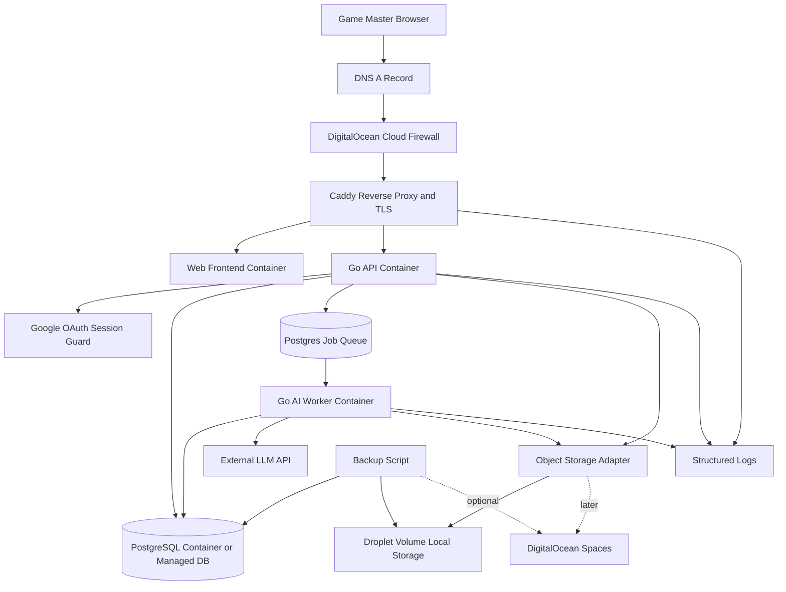
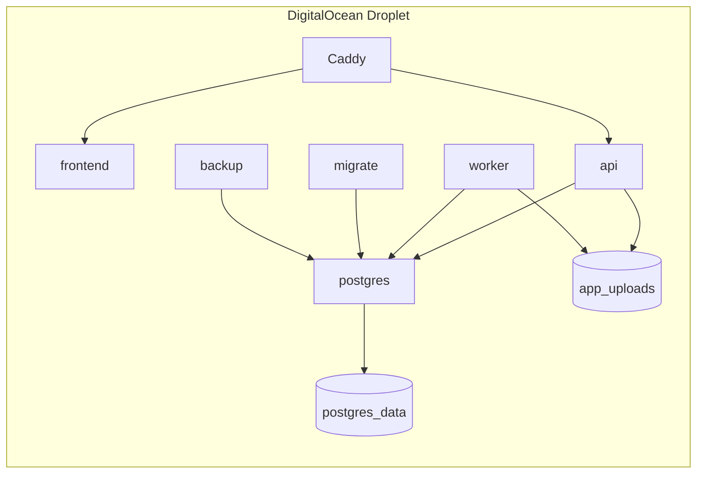
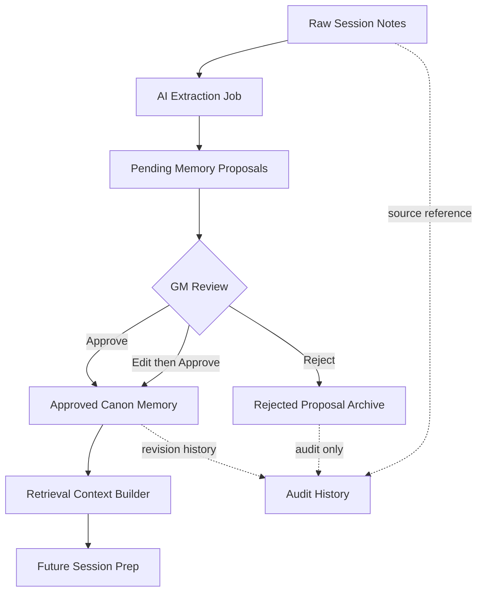
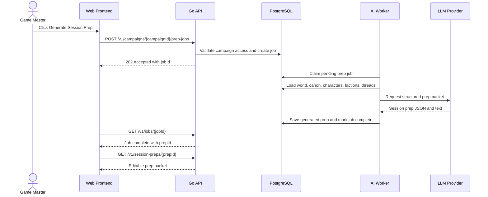
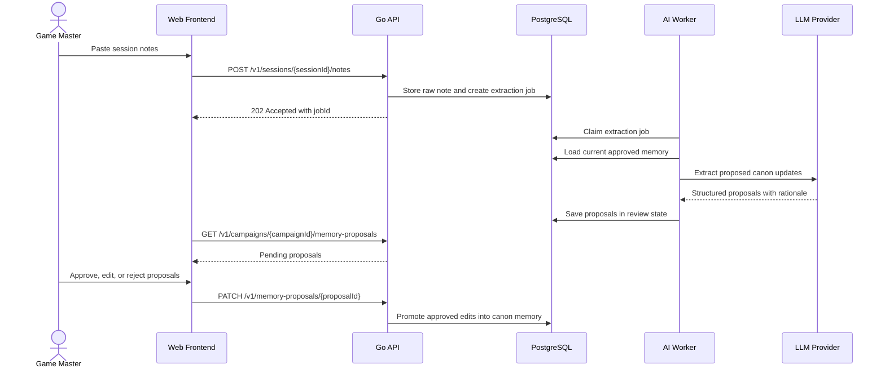

# AI Campaign Orchestration Platform — DigitalOcean Droplet Architecture

**Version:** 0.3  
**Date:** June 2026  
**Audience:** Product owner, developers, future implementation agents, and reviewers  
**Scope:** DigitalOcean-droplet-first MVP architecture for a web-based AI campaign copilot that helps tabletop game masters manage persistent campaign memory, generate session preparation, and approve canon updates.

---

## 1. Executive Summary

The AI Campaign Orchestration Platform is a web application for tabletop roleplaying game masters. It helps the GM create a campaign world, generate session prep, submit post-session notes, extract proposed changes, and approve selected updates into official campaign canon.

This version of the architecture intentionally focuses on a **DigitalOcean droplet-first deployment**. The goal is to keep the first private beta cheap, understandable, and easy to debug while still building the software in a way that can later move to managed services or AWS without a rewrite.

The MVP is deployed as a small set of Docker containers on one droplet:

- **Caddy** for HTTPS and reverse proxying.
- **Web frontend** for the GM user interface.
- **Go API** for business logic and persistence.
- **PostgreSQL** for campaign data, jobs, and memory.
- **Go AI worker** for long-running LLM jobs.
- **Backup process** for database and upload backups.
- **Object storage adapter** that starts local and can later move to DigitalOcean Spaces or S3.

The most important design rule is: **the AI may propose, but the GM decides what becomes canon.** Raw notes, AI proposals, and approved memory must stay separate.

---

## 2. Product and Architecture Goals

### 2.1 MVP Product Goals

The MVP must demonstrate the full campaign memory loop:

1. A GM creates a campaign and enters the world framework.
2. The system generates session prep from approved memory.
3. The GM plays the session outside the app.
4. The GM submits notes about what happened.
5. The AI extracts proposed campaign updates.
6. The GM approves, edits, or rejects those proposals.
7. Future session generation uses only approved campaign memory.

### 2.2 Architecture Goals

| Goal | Architecture Decision |
|---|---|
| Keep cost low before users exist | Run the private beta on a single DigitalOcean droplet. |
| Keep deployment understandable | Use Docker Compose instead of Kubernetes or complex cloud primitives. |
| Avoid request timeouts | Run AI generation and note extraction asynchronously through a job table. |
| Protect campaign continuity | Separate raw notes, proposed updates, approved canon, and rejected proposals. |
| Make future migration possible | Use containers, PostgreSQL, environment variables, and storage interfaces. |
| Control AI cost | Add usage tracking, quotas, model metadata, and job accounting from the beginning. |
| Keep the GM in control | Use a review queue before any AI-generated update becomes canon. |

### 2.3 Non-Goals for the First Droplet MVP

- No Kubernetes.
- No multi-region infrastructure.
- No autoscaling.
- No full virtual tabletop.
- No public marketplace.
- No real-time multiplayer game state.
- No autonomous canon changes.
- No multi-agent system unless the core single-worker loop is already reliable.

---

## 3. DigitalOcean Droplet Architecture Overview

The first deployment is a single Linux droplet running Docker Compose. Caddy terminates TLS and routes traffic to the frontend and API containers. The API stores data in PostgreSQL and creates background jobs for expensive AI work. The worker claims jobs from PostgreSQL, talks to the LLM provider, validates outputs, and writes results back to the database.



### 3.1 Droplet Sizing

The private beta runtime target is a **2 vCPU / 4 GB RAM** DigitalOcean droplet. This capacity supports the API, frontend, PostgreSQL, worker, Caddy, and backup process for early private-beta traffic.

Sizing tiers are defined as follows:

| Stage | Droplet | Role |
|---|---:|---|
| Local/solo testing | 1 vCPU / 1–2 GB RAM | Smoke tests and local validation only. |
| Private beta | 2 vCPU / 4 GB RAM | Default production MVP runtime. |
| Higher-load beta | 4 vCPU / 8 GB RAM | Scale-up target if job latency, memory, or database load exceeds the private-beta baseline. |

The expected early bottlenecks are AI latency, AI cost, and campaign-memory quality rather than HTTP request throughput.

### 3.2 Network Boundary

Only these ports are exposed at the network boundary:

| Port | Purpose | Public? |
|---:|---|---|
| 80 | HTTP challenge/redirect to HTTPS | Yes |
| 443 | HTTPS app traffic | Yes |
| 22 | SSH admin access | Restricted to owner IP |
| 5432 | PostgreSQL | No public access |
| 3000/5173/etc. | Internal frontend container ports | No public access |
| 8080 | Internal API container port | No public access |

The deployment uses the DigitalOcean cloud firewall plus host firewall rules. The database and internal services are reachable only on the Docker network.

---

## 4. Runtime Containers and Responsibilities

The Docker Compose runtime is explicit, with one clear responsibility per service.



### 4.1 Caddy Reverse Proxy

**Purpose:** Public entry point for the app.

Caddy handles:

- Automatic TLS certificates through Let's Encrypt.
- HTTP to HTTPS redirects.
- Routing `/` to the frontend.
- Routing `/api/*` or `/v1/*` to the Go API.
- Optional compression.
- Access logs.
- Security headers.

Operational requirements:

- Caddy is the only container exposed to the public web.
- Caddy does not contain application secrets.
- Caddy writes logs to stdout so Docker can collect them.
- Caddy configuration is version-controlled with environment-based domain names.

Example route shape:

```text
https://app.example.com/       -> frontend container
https://app.example.com/v1/*   -> api container
```

### 4.2 Web Frontend Container

**Purpose:** User-facing application for the GM.

The frontend provides screens for:

- Login and account onboarding.
- Campaign dashboard.
- World framework creation.
- Character, faction, location, and story-thread management.
- Session prep generation and editing.
- Session note submission.
- Memory proposal review queue.
- Canon memory browser.
- Basic account/settings pages.

Architecture contract:

- The frontend is packaged as a containerized web application.
- The frontend communicates with the backend only through documented `/v1` API endpoints.
- Frontend build artifacts and runtime configuration are environment-specific and do not contain server-side secrets.
- The frontend may be implemented as either a standalone web container or a static build served through Caddy; both shapes preserve the same API boundary.

### 4.3 Go API Container

**Purpose:** Main business logic layer and HTTP API.

The API owns:

- Authentication/session validation.
- Campaign-level authorization.
- CRUD for campaigns, sessions, characters, factions, locations, and story threads.
- Memory proposal review actions.
- Job creation for AI tasks.
- Retrieval context assembly endpoints.
- Usage and cost tracking.
- Audit logging.

The API does not run long LLM calls directly during user requests. It creates jobs and returns `202 Accepted` with a job ID. The frontend polls job status or later uses server-sent events/websockets.

### 4.4 PostgreSQL Container or Managed Database

**Purpose:** Source of truth for application state.

PostgreSQL stores:

- Users and identities.
- Campaigns and memberships.
- World framework records.
- Characters, factions, locations, story threads.
- Sessions and raw notes.
- AI job queue.
- Memory proposals.
- Approved canon memory.
- Generated session prep packets.
- Audit log entries.
- Usage accounting and AI model metadata.

For the first droplet MVP, PostgreSQL can run as a container with a persistent Docker volume. For a safer beta, DigitalOcean Managed PostgreSQL is better because backups, upgrades, and failure recovery are cleaner. If cost matters most, containerized PostgreSQL is acceptable as long as backups are automated from day one.

### 4.5 Go AI Worker Container

**Purpose:** Run slow, expensive, and retryable AI workflows outside the web request path.

The worker:

- Claims pending jobs from the database.
- Loads campaign context and source records.
- Builds prompts or structured model requests.
- Calls the LLM provider.
- Parses and validates structured outputs.
- Stores generated prep or proposed memory updates.
- Records token usage, cost estimate, latency, model, and prompt version.
- Marks jobs complete or failed.

The first worker can poll PostgreSQL every few seconds. Later, this can move to Redis, SQS, or a managed queue if necessary.

### 4.6 Migration Container

**Purpose:** Apply database schema changes safely.

The migration service uses a tool such as `golang-migrate`, `goose`, or `atlas` and runs on deploy before the API and worker begin serving traffic.

Rules:

- Every schema change gets a migration file.
- Migrations are committed with the application code.
- Production deploys run migrations once.
- Destructive migrations require manual review.

### 4.7 Backup Process

**Purpose:** Make the droplet MVP recoverable.

Backups include:

- PostgreSQL dumps.
- Uploaded files if using local object storage.
- Environment/config documentation, not secrets in plain text.

Minimum backup schedule:

| Backup | Frequency | Retention |
|---|---:|---:|
| PostgreSQL logical dump | Daily | 7–14 days |
| Upload directory archive | Daily | 7–14 days |
| Before-deploy database snapshot | Before risky migrations | Keep last 3 |

Backups are stored off the droplet for beta and production environments. DigitalOcean Spaces is the S3-compatible storage target for this deployment family.

### 4.8 Object Storage Adapter

**Purpose:** Store files without locking the application to local disk.

The MVP may need storage for:

- Exported campaign prep packets.
- Uploaded notes or reference documents later.
- Generated PDFs or campaign summaries later.
- Debug artifacts, if retained.

The application uses an object storage interface:

```go
type ObjectStore interface {
    Put(ctx context.Context, key string, body io.Reader, contentType string) error
    Get(ctx context.Context, key string) (io.ReadCloser, error)
    Delete(ctx context.Context, key string) error
    SignedURL(ctx context.Context, key string, ttl time.Duration) (string, error)
}
```

Initial implementations:

- `LocalObjectStore` writes to a mounted droplet volume.
- `S3ObjectStore` works with DigitalOcean Spaces or AWS S3.

---

## 5. Core Data Model

The data model supports structured campaign memory without overfitting early implementation details. Stable concepts use normalized tables; evolving AI-specific payloads use JSONB.

### 5.1 Main Tables

| Table | Purpose |
|---|---|
| `users` | Internal user profile linked to OAuth identity. |
| `auth_identities` | Provider identity records such as Google subject IDs. |
| `campaigns` | Top-level campaign workspace. |
| `campaign_members` | User access to campaigns; MVP may only have owner role. |
| `world_frameworks` | Campaign premise, tone, themes, setting, constraints. |
| `characters` | Player characters and NPCs. |
| `factions` | Organizations, enemies, allies, goals, and relationship state. |
| `locations` | Cities, regions, dungeons, landmarks, and important places. |
| `story_threads` | Open hooks, unresolved quests, mysteries, and conflicts. |
| `sessions` | Planned or completed gameplay sessions. |
| `session_notes` | Raw notes submitted by the GM. |
| `ai_jobs` | Background work queue and job state. |
| `memory_proposals` | AI-proposed changes awaiting review. |
| `canon_events` | Approved campaign facts and historical events. |
| `session_preps` | Generated session preparation packets. |
| `audit_events` | Human and AI actions requiring traceability. |
| `usage_events` | Token usage, model usage, and estimated AI cost. |

### 5.2 Memory State Flow



### 5.3 Status Fields

Use explicit lifecycle statuses instead of boolean flags.

| Entity | Statuses |
|---|---|
| `sessions` | `planned`, `played`, `archived` |
| `ai_jobs` | `pending`, `running`, `succeeded`, `failed`, `cancelled` |
| `memory_proposals` | `pending`, `approved`, `edited_approved`, `rejected`, `superseded` |
| `canon_events` | `active`, `revised`, `archived` |
| `story_threads` | `open`, `resolved`, `paused`, `abandoned` |

### 5.4 AI Metadata Fields

Every AI-created record stores:

- `model_provider`
- `model_name`
- `prompt_version`
- `input_token_count`
- `output_token_count`
- `estimated_cost_usd`
- `source_record_ids`
- `schema_version`
- `created_by_job_id`
- `confidence` where appropriate
- `rationale` where useful for human review

These fields support debugging, replay, evaluation, and cost control.

---

## 6. API Design Principles

The API is versioned from the first release:

```text
/v1/...
```

All endpoints use JSON request and response bodies except future file upload endpoints. The API returns consistent error objects.

### 6.1 Standard Response Shapes

Success response for single resource:

```json
{
  "data": {
    "id": "cmp_123",
    "type": "campaign"
  }
}
```

Success response for lists:

```json
{
  "data": [],
  "pagination": {
    "limit": 50,
    "offset": 0,
    "total": 0
  }
}
```

Async job creation:

```json
{
  "data": {
    "jobId": "job_123",
    "status": "pending"
  }
}
```

Error response:

```json
{
  "error": {
    "code": "campaign_not_found",
    "message": "Campaign not found or access denied.",
    "requestId": "req_abc123"
  }
}
```

### 6.2 Common HTTP Status Codes

| Status | Meaning |
|---:|---|
| `200` | Successful read or update. |
| `201` | Resource created synchronously. |
| `202` | Async job accepted. |
| `400` | Invalid request body or validation error. |
| `401` | Not authenticated. |
| `403` | Authenticated but not allowed. |
| `404` | Resource not found or not visible to user. |
| `409` | Version conflict or invalid state transition. |
| `422` | Semantically invalid input. |
| `429` | Rate limit or quota exceeded. |
| `500` | Unexpected server error. |

---

## 7. API Documentation

### 7.1 Authentication and User Endpoints

#### `GET /v1/me`

Returns the currently authenticated user.

Response:

```json
{
  "data": {
    "id": "usr_123",
    "email": "gm@example.com",
    "displayName": "Robert",
    "createdAt": "2026-06-01T12:00:00Z"
  }
}
```

#### `POST /v1/auth/logout`

Logs out the current session if session-based auth is used. If the frontend uses a third-party auth SDK, this may be handled client-side and omitted from the backend MVP.

---

### 7.2 Campaign Endpoints

#### `POST /v1/campaigns`

Creates a campaign.

Request:

```json
{
  "name": "Shadows of Vaeloria",
  "system": "Dungeons & Dragons 5e",
  "description": "A dark fantasy campaign about lost gods and border kingdoms.",
  "visibility": "private"
}
```

Response: `201 Created`

```json
{
  "data": {
    "id": "cmp_123",
    "name": "Shadows of Vaeloria",
    "system": "Dungeons & Dragons 5e",
    "visibility": "private"
  }
}
```

#### `GET /v1/campaigns`

Lists campaigns available to the current user.

Query parameters:

| Parameter | Purpose |
|---|---|
| `limit` | Page size, default 50. |
| `offset` | Pagination offset. |

#### `GET /v1/campaigns/{campaignId}`

Returns campaign dashboard data, including high-level counts and current state.

#### `PATCH /v1/campaigns/{campaignId}`

Updates campaign metadata such as name, system, description, or archived state.

#### `DELETE /v1/campaigns/{campaignId}`

Soft-deletes or archives a campaign. The MVP uses archive/soft-delete behavior to avoid accidental data loss.

---

### 7.3 World Framework Endpoints

#### `PUT /v1/campaigns/{campaignId}/world-framework`

Creates or replaces the campaign's world framework.

Request:

```json
{
  "premise": "A border kingdom faces cult activity after an ancient moon temple reopens.",
  "tone": "Dark heroic fantasy with political tension",
  "themes": ["lost gods", "faction rivalry", "moral compromise"],
  "constraints": ["avoid slapstick", "keep horror PG-13"],
  "startingSituation": "The party arrives in Greyharbor after a string of disappearances."
}
```

#### `GET /v1/campaigns/{campaignId}/world-framework`

Returns the current world framework.

---

### 7.4 Character Endpoints

#### `POST /v1/campaigns/{campaignId}/characters`

Creates a player character or NPC.

Request:

```json
{
  "name": "Mira Thorn",
  "kind": "npc",
  "role": "Harbor informant",
  "status": "active",
  "summary": "Knows smuggling routes and fears the Moon Veil cult.",
  "tags": ["informant", "greyharbor"]
}
```

#### `GET /v1/campaigns/{campaignId}/characters`

Lists characters. Optional filters: `kind`, `status`, `q`, `tag`.

#### `GET /v1/characters/{characterId}`

Returns one character record.

#### `PATCH /v1/characters/{characterId}`

Updates a character.

#### `DELETE /v1/characters/{characterId}`

Archives a character.

---

### 7.5 Faction Endpoints

#### `POST /v1/campaigns/{campaignId}/factions`

Creates a faction.

Request:

```json
{
  "name": "The Moon Veil",
  "summary": "A cult seeking to restore a forgotten lunar deity.",
  "goals": ["recover moon relics", "infiltrate Greyharbor council"],
  "status": "active"
}
```

#### `GET /v1/campaigns/{campaignId}/factions`

Lists factions.

#### `PATCH /v1/factions/{factionId}`

Updates faction state, goals, relationships, or notes.

---

### 7.6 Location Endpoints

#### `POST /v1/campaigns/{campaignId}/locations`

Creates a location.

Request:

```json
{
  "name": "Greyharbor",
  "kind": "city",
  "summary": "A fog-covered port city controlled by rival merchant houses.",
  "status": "active",
  "tags": ["port", "politics", "cult activity"]
}
```

#### `GET /v1/campaigns/{campaignId}/locations`

Lists locations.

#### `PATCH /v1/locations/{locationId}`

Updates a location.

---

### 7.7 Story Thread Endpoints

#### `POST /v1/campaigns/{campaignId}/story-threads`

Creates an unresolved hook, quest, mystery, or conflict.

Request:

```json
{
  "title": "Missing lighthouse keepers",
  "summary": "Three keepers vanished after reporting silver lights offshore.",
  "status": "open",
  "priority": "high",
  "relatedEntityIds": ["loc_greyharbor", "fac_moonveil"]
}
```

#### `GET /v1/campaigns/{campaignId}/story-threads`

Lists story threads. Optional filters: `status`, `priority`, `q`.

#### `PATCH /v1/story-threads/{threadId}`

Updates or resolves a thread.

---

### 7.8 Session Endpoints

#### `POST /v1/campaigns/{campaignId}/sessions`

Creates a planned session.

Request:

```json
{
  "title": "Session 4: The Silver Wake",
  "scheduledFor": "2026-06-20T23:00:00Z",
  "goals": ["investigate lighthouse", "introduce merchant house conflict"]
}
```

#### `GET /v1/campaigns/{campaignId}/sessions`

Lists sessions for a campaign.

#### `GET /v1/sessions/{sessionId}`

Returns session details, related prep, notes, and job state summaries.

#### `PATCH /v1/sessions/{sessionId}`

Updates session metadata or marks it played.

---

### 7.9 Session Prep Generation Endpoints

#### `POST /v1/campaigns/{campaignId}/prep-jobs`

Starts an async AI job to generate a session prep packet.

Request:

```json
{
  "sessionId": "ses_123",
  "focus": "Investigation and faction tension",
  "desiredLengthHours": 3,
  "difficulty": "medium",
  "includeSections": ["opening", "encounters", "npcs", "factionMoves", "hooks"]
}
```

Response: `202 Accepted`

```json
{
  "data": {
    "jobId": "job_123",
    "status": "pending"
  }
}
```

#### `GET /v1/session-preps/{prepId}`

Returns a generated session prep packet.

Response:

```json
{
  "data": {
    "id": "prep_123",
    "sessionId": "ses_123",
    "title": "The Silver Wake",
    "summary": "The party investigates disappearances near the lighthouse.",
    "sections": {
      "opening": "Begin with fog bells ringing across Greyharbor.",
      "encounters": [],
      "npcs": [],
      "hooks": []
    },
    "sourceMemoryIds": ["canon_1", "thread_2"],
    "createdAt": "2026-06-12T12:00:00Z"
  }
}
```

#### `PATCH /v1/session-preps/{prepId}`

Allows the GM to edit or annotate generated prep.

---

### 7.10 Session Notes and Extraction Endpoints

#### `POST /v1/sessions/{sessionId}/notes`

Stores raw notes and optionally starts extraction.

Request:

```json
{
  "content": "The players questioned Mira, found a moon symbol under the pier, and angered House Veyr.",
  "sourceType": "manual_notes",
  "startExtraction": true
}
```

Response: `202 Accepted` if extraction starts.

```json
{
  "data": {
    "noteId": "note_123",
    "jobId": "job_456",
    "status": "pending"
  }
}
```

#### `GET /v1/sessions/{sessionId}/notes`

Lists notes for a session.

#### `POST /v1/session-notes/{noteId}/extraction-jobs`

Starts or restarts extraction for an existing note.

---

### 7.11 Memory Proposal Endpoints

#### `GET /v1/campaigns/{campaignId}/memory-proposals`

Returns proposed updates awaiting review.

Query parameters:

| Parameter | Purpose |
|---|---|
| `status` | `pending`, `approved`, `rejected`, `edited_approved`. |
| `type` | `canon_event`, `character_update`, `faction_update`, `location_update`, `story_thread_update`. |
| `sessionId` | Filter proposals created from one session. |

#### `GET /v1/memory-proposals/{proposalId}`

Returns one proposal with source notes, rationale, confidence, and proposed target entity.

#### `PATCH /v1/memory-proposals/{proposalId}`

Approves, edits, or rejects a proposal.

Approve request:

```json
{
  "action": "approve"
}
```

Edit then approve request:

```json
{
  "action": "edit_approve",
  "editedPayload": {
    "type": "canon_event",
    "summary": "The party discovered a Moon Veil symbol beneath Greyharbor's old pier.",
    "importance": "major"
  }
}
```

Reject request:

```json
{
  "action": "reject",
  "reason": "The AI misunderstood the symbol; it was from a different faction."
}
```

Response:

```json
{
  "data": {
    "proposalId": "prop_123",
    "status": "edited_approved",
    "createdCanonId": "canon_789"
  }
}
```

---

### 7.12 Canon Memory Endpoints

#### `GET /v1/campaigns/{campaignId}/canon-events`

Lists approved canon events.

Filters:

| Parameter | Purpose |
|---|---|
| `q` | Text search. |
| `importance` | `minor`, `normal`, `major`, `critical`. |
| `entityId` | Related character/faction/location/thread. |
| `sessionId` | Source session. |

#### `POST /v1/campaigns/{campaignId}/canon-events`

Allows the GM to manually add canon without AI extraction.

#### `PATCH /v1/canon-events/{canonId}`

Revises or archives a canon event. Revisions create audit history.

---

### 7.13 Job Endpoints

#### `GET /v1/jobs/{jobId}`

Returns async job status.

Response:

```json
{
  "data": {
    "id": "job_123",
    "type": "generate_session_prep",
    "status": "succeeded",
    "progress": 100,
    "result": {
      "prepId": "prep_123"
    },
    "error": null
  }
}
```

#### `POST /v1/jobs/{jobId}/cancel`

Cancels a pending job if it has not started. Running LLM jobs may not be cancellable in the MVP.

---

### 7.14 Retrieval and Search Endpoints

#### `GET /v1/campaigns/{campaignId}/search`

Searches approved campaign memory and optionally raw notes.

Query parameters:

| Parameter | Purpose |
|---|---|
| `q` | Search text. |
| `scope` | `canon`, `characters`, `factions`, `locations`, `threads`, `sessions`, or `all`. |
| `includeRawNotes` | Default false. Raw notes are excluded from trusted canon retrieval unless explicitly requested. |

#### `POST /v1/campaigns/{campaignId}/retrieval-preview`

Debug/admin endpoint showing what context would be sent to the AI for a given task. This endpoint supports MVP development and prompt tuning.

---

## 8. AI Workflows

### 8.1 Generate Session Prep



The prep job creates a structured packet with predictable sections:

- Session title and summary.
- Opening scene.
- Main beats.
- Encounter suggestions.
- NPC/faction movements.
- Consequences from prior events.
- Optional clues, secrets, or twists.
- Open questions for the GM.
- Source memory references.

### 8.2 Extract Memory Proposals from Notes



The extraction job produces proposals, not permanent updates. Each proposal includes:

- Proposal type.
- Summary.
- Target entity if relevant.
- Source note reference.
- Confidence.
- Rationale.
- Potential conflicts.
- Proposed canon payload.

### 8.3 Prompt and Schema Versioning

Each AI workflow has a prompt version such as:

```text
session_prep.v1
note_extraction.v1
retrieval_context.v1
```

Generated records store the prompt version so output quality can be compared across prompt revisions.

### 8.4 AI Architecture

#### 8.4.1 Overview

The model itself retains no state between calls — every worker call to the LLM
provider is a fresh, independent request. Campaign memory is maintained by
storing everything in PostgreSQL and re-assembling the relevant parts into the
prompt on each call. The database is the system of record; the model is not.

The AI layer performs three steps per job:
- Retrieve the relevant campaign context from the database
- Build a prompt from that context
- Call the model and validate the output against the expected schema before saving it

#### 8.4.2 Model Routing

The two AI tasks have different quality/cost tradeoffs, so each is routed to a
different model:

| Task | Model | Why |
|---|---|---|
| Note extraction | `gpt-4o-mini` | Cheaper, runs after every session |
| Session prep generation | `gpt-4o` | Better quality, GM actually reads this |

The model used is stored in the job metadata so it can be changed later without
touching the core logic.

#### 8.4.3 Retrieval (RAG)

Before building the prompt, the worker retrieves the relevant context from the
database. The governing rule is that retrieval only pulls from approved canon —
never raw notes, pending proposals, or anything the GM hasn't signed off on.

A session prep job retrieves:
- The world framework
- Active characters and factions
- Open story threads
- The last 10–20 canon events sorted by importance and recency

A note extraction job retrieves:
- Active characters, factions, and locations (so the model can recognize entity names)
- Recent canon events (so it can spot contradictions with what already happened)

The MVP uses plain SQL queries against the existing tables — no vector database
is required. pgvector or a dedicated vector store (e.g. ChromaDB) is a candidate
if plain-text search proves insufficient at scale.

#### 8.4.4 Prompt Construction

Each job type has its own versioned prompt template (ties into section 8.3).
The prompt is built in three parts:

1. **System prompt** — establishes the model's role, the expected response
   format, and the constraint that it must not contradict the supplied canon.
2. **Context block** — the retrieved database context, laid out in clearly
   labeled sections so the model can locate what it needs.
3. **Task instruction** — the specific task, plus any GM-set parameters such as
   session focus or difficulty.

#### 8.4.5 Structured Outputs

Both tasks use the provider's structured-output mode (e.g. OpenAI's
`response_format: { type: "json_object" }`) to receive JSON rather than free
text. The worker validates the response against the expected schema before
writing anything to the database; a schema mismatch fails the job so it can be
retried.

Session prep output includes fields such as `title`, `summary`, `opening`,
`mainBeats`, `encounters`, `npcMovements`, `hooks`, and `sourceMemoryIds`.

Extraction output is an array of proposals, each with `type`, `summary`,
`confidence`, `rationale`, and a `proposedPayload` that maps to the target entity.

#### 8.4.6 What Is Kept Out of the Model

This is the most important design decision in the AI layer. The following are
never passed into the model as context:

- Raw session notes — untrusted and unreviewed
- Pending proposals — not yet approved
- Rejected proposals — retained for audit history only
- Previous AI outputs — every job is built fresh from the database

The GM approval workflow exists so that nothing becomes "real" in the campaign
world until the GM says so; this rule is what enforces that boundary on the AI
side.

---

## 9. Deployment Design

### 9.1 Repository Structure

Repository layout:

```text
ai-campaign-orchestration/
  apps/
    web/
  services/
    api/
    worker/
  packages/
    shared/
  infra/
    docker-compose.yml
    Caddyfile
    env.example
    scripts/
      backup-postgres.sh
      restore-postgres.sh
      deploy.sh
  docs/
    architecture/
```

### 9.2 Docker Compose Services

Docker Compose defines these services:

| Service | Image/Build | Purpose |
|---|---|---|
| `caddy` | `caddy:latest` or pinned stable | TLS and reverse proxy. |
| `web` | Built from `apps/web` | Frontend app. |
| `api` | Built from `services/api` | HTTP API. |
| `worker` | Built from `services/worker` | Background AI jobs. |
| `postgres` | Pinned PostgreSQL image | Local database if not using managed DB. |
| `migrate` | API image with migration command | Applies database migrations. |
| `backup` | Small script container or host cron | Database/upload backups. |

### 9.3 Environment Variables

Minimum environment variables:

```text
APP_ENV=production
APP_BASE_URL=https://app.example.com
DATABASE_URL=postgres://...
GOOGLE_CLIENT_ID=...
GOOGLE_CLIENT_SECRET=...
SESSION_SECRET=...
OPENAI_API_KEY=...
ANTHROPIC_API_KEY=...
LLM_PROVIDER=openai
OBJECT_STORE_BACKEND=local
OBJECT_STORE_LOCAL_PATH=/data/uploads
AI_MONTHLY_COST_LIMIT_USD=50
```

Rules:

- Commit `.env.example`, never commit `.env.production`.
- Keep secrets on the droplet with restricted permissions.
- Rotate secrets if they are ever exposed.

### 9.4 Deployment Flow

The deployment flow is:

```text
git pull
build containers
run migrations
restart services
health check
backup old release metadata
```

The deploy script fails fast if migrations fail or health checks fail.

### 9.5 Health Checks

Minimum endpoints:

| Endpoint | Purpose |
|---|---|
| `GET /v1/healthz` | API process is alive. |
| `GET /v1/readyz` | API can reach database and required dependencies. |
| `GET /v1/version` | Returns build version, commit SHA, and environment. |

---

## 10. Security and Reliability

### 10.1 Access Control

Every campaign-owned record must enforce campaign membership. Do not trust client-provided campaign IDs without checking access.

Basic roles:

| Role | Permissions |
|---|---|
| `owner` | Full control, billing/export/delete later. |
| `gm` | Manage campaign, generate prep, approve memory. |
| `viewer` | Read-only access later; can be deferred for MVP. |

MVP can start with `owner` only and still design the table for roles.

### 10.2 AI Safety and Data Integrity

- AI output must pass schema validation before storage.
- Generated text is draft content, not canon.
- Only approved memory becomes trusted retrieval context.
- Proposal approval is audited with user ID and timestamp.
- Canon revisions preserve history rather than overwrite silently.
- Raw notes are treated as untrusted content and framed as data, not instructions, to reduce prompt-injection risk.

### 10.3 Logging and Monitoring

Log structured events:

- Request ID.
- User ID where safe.
- Campaign ID where safe.
- Endpoint.
- Job ID.
- Latency.
- Error code.
- AI model/provider metadata.

Avoid logging full campaign notes or full LLM prompts by default because those may contain private creative content.

### 10.4 Backup and Restore Testing

Backups are not real until restore is tested. At least once before beta, perform a restore into a temporary database and verify:

- Campaigns load.
- Sessions load.
- Notes load.
- Memory proposals load.
- Approved canon loads.
- Generated prep loads.

---

## 11. Cost Control

DigitalOcean hosting cost is predictable. AI cost is the variable operational risk.

### 11.1 Infrastructure Cost Shape

| Item | Early Estimate |
|---|---:|
| Droplet 2 vCPU / 4 GB | Low monthly fixed cost |
| Backups/snapshots | Small additional cost |
| Domain/DNS | Minimal |
| Spaces object storage | Optional; low early cost |
| Managed Postgres | Optional; higher but safer |

### 11.2 AI Cost Controls

Implement from the beginning:

- Per-user monthly AI budget counter.
- Per-campaign monthly AI budget counter.
- Max note length for extraction.
- Max context size for generation.
- Model routing by task type.
- Job-level token and cost estimates.
- Admin-visible usage dashboard.

A simple first quota model:

| Plan/Stage | Limit |
|---|---:|
| Private beta | Manual allowlist plus monthly cost cap. |
| Free later | Very small generation/extraction quota. |
| Paid later | Larger quota with hard cap or overage controls. |

---

## 12. Migration Path Beyond the Droplet

The droplet architecture is the first deployment target, not a permanent constraint.

| Droplet Component | Next Step | Later Cloud Equivalent |
|---|---|---|
| Caddy | Keep until traffic warrants managed edge | Cloudflare, CloudFront, or managed load balancer |
| Web container | Static export or app hosting | S3/CloudFront, Vercel, Netlify |
| Go API container | Move unchanged | ECS Fargate, Fly.io, Render, App Runner |
| Go worker container | Move unchanged | ECS worker, background worker platform |
| PostgreSQL container | Managed DB | DigitalOcean Managed Postgres or AWS RDS |
| Postgres job table | Managed queue | SQS, Redis queue, or managed job system |
| Local object storage | Spaces | DigitalOcean Spaces or AWS S3 |
| Shell deploy | CI/CD | GitHub Actions deploy pipeline |

Application logic avoids hardcoded droplet paths, local-only storage assumptions, and manual server state.

---

## 13. MVP Build Order

MVP implementation sequence:

1. Repo structure and Docker Compose skeleton.
2. PostgreSQL migrations and base schema.
3. Go API health checks and campaign CRUD.
4. Frontend campaign dashboard.
5. World framework editor.
6. Session CRUD and note submission.
7. AI job table and worker loop.
8. Session prep generation job.
9. Note extraction job.
10. Memory proposal review queue.
11. Canon memory browser.
12. Usage tracking and basic admin metrics.
13. Backup/restore scripts.
14. Droplet deployment and smoke tests.

### 13.1 Definition of Done for Private Beta

The system is beta-ready when:

- A GM can create a campaign.
- A GM can enter a world framework.
- A GM can create a session.
- A GM can generate editable session prep.
- A GM can submit notes after play.
- The system can extract proposed updates.
- A GM can approve/edit/reject proposals.
- Approved updates appear in canon memory.
- Future generated prep references approved memory.
- Backups run and restore has been tested.
- AI usage and job failures are visible to the operator.

---

## 14. Architecture Decisions

| Decision Area | MVP Architecture |
|---|---|
| Deployment target | Single DigitalOcean droplet running Docker Compose. |
| Frontend boundary | Containerized web frontend using documented `/v1` backend APIs. |
| API runtime | Go HTTP API container. |
| Worker runtime | Go background worker container. |
| Database | PostgreSQL as the system of record. Containerized PostgreSQL is supported for the droplet MVP; managed PostgreSQL can replace it without changing application code. |
| Authentication | OAuth-backed user identity with backend session validation. |
| LLM integration | Internal provider interface used by the worker; provider details are stored in AI metadata. |
| Retrieval | Approved canon, structured records, and text search form the initial retrieval layer. Vector embeddings are outside the MVP unless SQL/text retrieval proves insufficient. |
| Object storage | Object store interface with local droplet storage as the initial backend and S3-compatible storage as a later backend. |
| Job progress | Frontend polls job status endpoints; SSE or websockets can be added later without changing the job model. |

---

## 15. Architecture Summary

The private beta architecture uses a DigitalOcean droplet, Docker Compose, Caddy, a containerized web frontend, a Go API, PostgreSQL, a Go AI worker, and automated backups. The application keeps AI work asynchronous, stores all durable state in PostgreSQL, and separates raw notes, proposed updates, and approved canon.

The architecture preserves clear migration seams through container boundaries, environment-based configuration, database migrations, an object storage adapter, a job queue abstraction, and an internal LLM provider interface.
